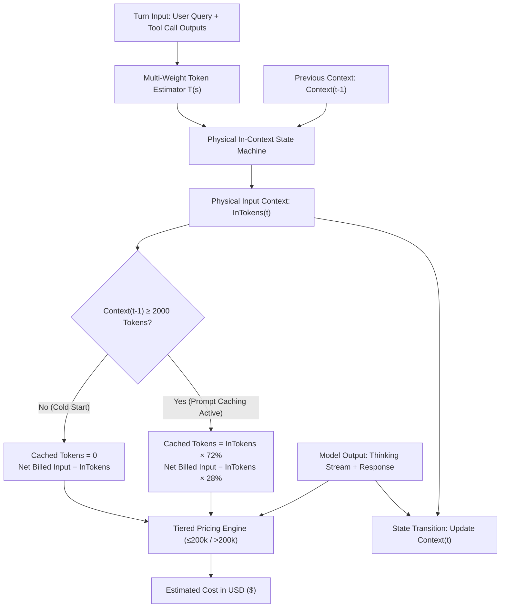

<div align="center">
  <h1>🚀 Antigravity Better</h1>
  <p><strong>自定义你的 Antigravity AI 聊天面板。你的 IDE，你做主。</strong></p>
  <p><strong>Customize your Antigravity AI chat panel. Your IDE, your rules.</strong></p>
  <br>
  <p>
    <strong>English</strong> •
    <a href="./README_ZH.md">中文</a>
  </p>
  <p>
    
    
    
    
    
    <br><br>
    <a href="https://github.com/016/Antigravity-Better/releases"></a>
  </p>
</div>

---

## 📸 Screenshots

<p align="center">
  
  
</p>

---

## ✨ What is Antigravity Better?

**Antigravity Better** is a lightweight, zero-dependency toolkit for customizing the AI chat panel in **Antigravity** - Google's new AI-powered IDE.

We provide a **single HTML file** that you can drop into your IDE to unlock powerful customizations - without touching any source code or installing extensions.

You can freely customize this HTML file to build your own features. Following our pre-built framework makes modifications incredibly easy - just add your CSS rules and JS logic, and you're good to go!

> 💡 **Philosophy**: We build the highway; you drive whatever car you want.

### Compatibility Note

- ✅ **Primary Target**: Antigravity (Google's AI IDE)
  - **v0.3.x / v0.2.x**: Supports IDE v1.18.3+ (New `workbench.html` architecture)
  - **v0.1.x**: Supports older IDE versions(<1.18.3) (Legacy `cascade-panel.html` architecture)
- ⚠️ **Potentially Compatible**: Other VS Code-based AI IDEs (Cursor, Windsurf, etc.) may work with modifications, but we cannot guarantee compatibility.

---

## 🚀 Features

### Release Timeline (Partial)

- **v0.3.0**: Formal release of the Token & Cost Analytics dashboard with physical in-context accumulation, 72% dynamic prompt caching model, and production-grade metric tracking:
  - **Physical In-Context Accumulation & 72% Prompt Caching Model**: Implements turn-by-turn physical active context tracking and dynamic prefix caching modeling (activates 72% cache hit rate when context >= 2000 tokens) for agentic workflows; cleanly differentiates net input, output/reasoning, and cached tokens; supports <=200k vs >200k tiered pricing unknown models remain unpriced and are shown as partial/unknown cost; complete open-source technical specification published at [`documents/TOKEN_MEASUREMENT_AND_PRICING_ALGORITHM_REPORT.md`](documents/TOKEN_MEASUREMENT_AND_PRICING_ALGORITHM_REPORT.md).
  - **Immersive Context Jump Navigation (Up/Down) & Sticky Disentanglement**: Fully resolves the geometric scrolling failure caused by Antigravity's native `sticky top-0 z-10` user message headers; rebuilt on non-sticky physical `turnNode` containers with dual-layer smooth scrolling (`turnNode.scrollIntoView` + container offset) and auto-triggers "Load older messages" for virtualized history.
  - **Complete Refresh Invalidation & Dirty Record Self-Healing**: Clicking "🔄 Refresh" wipes DOM tracking dataset attributes and in-memory caches, purges corrupted zero-cache/cost-unknown historical records, and guarantees that valid token calculations never show "Unknown" cost.
  - **Collapsible Daily Breakdown Table & High-Contrast Header**: Enhances dark-mode readability with crisp `#f8fafc` typography and adds an interactive collapsible drawer (`[ Collapse Table ▴ ]` / `[ Expand Table ▾ ]`) to save vertical scroll space.
  - **Multi-Dimensional Analytics Dashboard**: Features 「📈 Usage Trends」, 「🏷️ Model Pricing」, and 「⚙️ Maintenance & Data」 tabs; line charts cleanly layer total tokens (cyan solid) and cache hits (purple dashed) with point-aligned tooltips, collapsible legend drawer, and manual refresh.
  - **Locale-Adaptive Large Unit Formatting**: Automatically formats numbers according to user language (Chinese: 万, 亿, 万亿 with precise decimals like `53.78亿`, `666.78亿`, `0.69万亿`; English: standard international metrics `K`, `M`, `B`, `T`), reacting instantly to language toggles.
  - **Cross-Platform Offline Session Scanner**: Provides `scripts/scan_history_conversations.py` to scan historical conversations and SQLite metadata across Linux/macOS/Windows, mathematically aligned with frontend real-time tracking for seamless import and archiving.
  - **Non-Destructive Safety Boundary**: Guarantees zero data loss to backend conversation DBs (`.sqlite` / `transcript.jsonl`) during frontend chart cache resets.
  - **Interface Cleanliness & Focus Desensitization**: Removes extra corner marks around input prompt toolbar file icons; strictly enforces CSP and Trusted Types compliance with zero `innerHTML` injection.
- **v0.2.13**: Hardens high-risk command protection, enhances LaTeX rendering robustness, and refines UX:
  - **High-Risk Command Shield**: Rebuilds command detection with universal execution prefix matching (`DANGER_CMD_PREFIX`) supporting pipelines, semicolons, IDE parameter tags (`CommandLine:` / `"CommandLine":`), `sudo`/`xargs`/`bash -c`, and absolute paths; fixes DOM traversal truncation caused by generic Tailwind CSS class names; enforces dual safety audit in scoped permission dialogs with 5s safety circuit breaker to auto-skip unpermitted dangerous commands (`rm`, `del`, etc.) with zero false positives on standard Git and build commands.
  - **LaTeX Engine Enhancements**: Adds auto-stitching for multi-line math split by `<br>` tags via TreeWalker and `elem.normalize()`; introduces HTML entity decoding (`&gt;`, `&lt;`, `&quot;`, `&#39;`, `&nbsp;`); adds environment-aware ampersand handling (`&` preserved inside `aligned`/`cases`/`matrix`, escaped as `\&` outside); auto-repairs swallowed backslashes in vertical spacing (`\[...pt]` -> `\\[...pt]`) and trailing single backslashes; extends emphasis tag (`<em>`/`<strong>`) unpacking to `$$...$$` block math and `\[...\]` expressions.
  - **UX & Safety Confirmations**: Introduces a dedicated toggle for dangerous commands with a secondary confirmation modal (covering workspace scope, behavioral constraints, and Git backups); refactors settings cards to default collapsed with "Auto-Accept" prioritized at the top; introduces dual-color Toast feedback (emerald skip / red alert) with synchronized floating stats.
- **v0.2.11**: Adds `Submit` auto-accept support with questionnaire modal protection, introduces `Submit` and `Tool Permissions` independent toggles to bypass normal tool permission prompts, and fixes a blind spot in the high-risk command filter for elements within the same container.
- **v0.2.10**: Fixes the Undo icon rendering issue in conversations by allowing the required Google resources in the Content Security Policy. The fix proposal came from hanliangwei.
- **v0.2.9**: Fixes accidental auto-clicks on conversation titles when creating a new conversation by skipping title buttons that carry both `title` and `grow`.
- **v0.2.8**: Fixes the app version string that was still shown as `0.2.2`, and aligns documentation version info.
- **v0.2.7**: Enhances update checks with dual-source fallback (GitHub API + backup API), shows current/remote version comparison, adds a download entry, and introduces an auto-dismiss system tool for corrupted-install warnings.
- **v0.2.6**: Adds auto-accept rules for diff confirmations and permission prompts, with safer handling for `accept all`, `always allow`, and `allow this conversation`.
- **v0.2.5**: Improves workbench UI, replaces emoji icons with inline SVG, and refines tab alignment, floating settings button, update-check button style, and close-button hit area.
- **v0.2.4**: Fixes LaTeX inline formula rendering issue (#23).
- **v0.2.3**: Adds a deployment tool for `workbench.html`.
- **v0.2.2**: Fixes copy button misalignment and auto-accept click issues, and adds max-click limit with reset.
- **v0.2.1**: Migrates to IDE v1.18.3+ `workbench.html` architecture with v0.1.7 feature parity.
- **v0.1.7**: Stable legacy-architecture release (`cascade-panel.html`).
- **v0.1.6**: Merges auto-retry capability into auto-accept.
- **v0.1.5**: Adds LaTeX formula rendering.
- **v0.1.4**: Adds font-size control and version check.
- **v0.1.3**: Adds safety rules to block dangerous auto-executed commands.
- **v0.1.2**: Adds auto-retry mechanism.
- **v0.1.1**: First core feature set: custom colors, hotkey override, and i18n support.

### 📊 Token & Cost Analytics (Usage, Algorithm Model & SSH Scanner Guide)

> [!WARNING]
> **⚠️ Estimation & Discrepancy Disclaimer**
> The Token measurement and cost analytics system implemented in this project operates completely within your local environment (via frontend DOM differential monitoring and local session log scanning). It relies on character-weighted heuristic tokenization and a physical in-context accumulation state machine.
> **These metrics are purely local estimations (Estimation Model) designed for developer awareness and long-session cost trend monitoring. They may differ significantly from official billing on cloud providers (such as Google Cloud / Vertex AI / Google AI Studio)**.
> Root causes of discrepancies include: differences between heuristic weights and official BPE/SentencePiece tokenizers, implicit system prompts and environment metadata injected by the IDE, cloud-side KV Cache eviction/dynamic reuse policies, and specific subscription tier quotas or enterprise discounts (e.g., Google One AI Premium / Google Workspace). All monetary figures are for development reference only; official cloud provider invoices shall prevail.

#### 📐 Simplified Measurement & Pricing Algorithm

To accurately capture multi-turn conversation growth and Agent tool execution overhead within a client-side sandbox lacking direct billing APIs, we engineered a simplified model combining **Physical In-Context Accumulation + Dynamic 72% Prompt Caching + Tiered Pricing**:



**Core Formulas at a Glance**:
1. **Multi-Weight Token Estimator**:
   $$T(s) = 1.25 \times \text{CJK Chars} + 0.80 \times \text{Symbols} + 0.28 \times \text{Other Characters}$$
2. **Physical In-Context Accumulation**:
   $$\text{InTokens}_t = \max\left(\text{TurnRawIn}_t, \, \text{Context}_{t-1} + \text{TurnRawIn}_t\right)$$
   (Accumulates prior dialog history, system guidance, and large tool terminal outputs into the physical input payload).
3. **Dynamic 72% Prompt Caching**:
   $$\text{CacheTokens}_t = \begin{cases} 0, & \text{Context}_{t-1} < 2000 \\ \min\left(\text{Context}_{t-1}, \, \lfloor \text{InTokens}_t \times 0.72 \rfloor\right), & \text{Context}_{t-1} \ge 2000 \end{cases}$$
   (In long sessions, approximately 72% of input tokens benefit from cloud KV cache discounts, resulting in net input billed at $28\%$).
4. **Tiered Pricing Model**:
   $$\text{Cost}_t = \frac{\text{NetInTokens}_t \times P_{\text{in}} + \text{OutTokens}_t \times P_{\text{out}} + \text{CacheTokens}_t \times P_{\text{cache}}}{1,000,000}$$
   Automatically applies pricing according to model configurations (e.g., Gemini 3.8 Flash: input \$0.75/M, cache read \$0.075/M, output \$3.75/M; Gemini 3.1 Pro supports >200k tiered pricing).

> 📖 For full mathematical proofs, dual-engine isomorphic alignment, and dirty record self-healing, see the white paper: [`documents/TOKEN_MEASUREMENT_AND_PRICING_ALGORITHM_REPORT.md`](documents/TOKEN_MEASUREMENT_AND_PRICING_ALGORITHM_REPORT.md).

#### 🛠️ Usage & Historical Retroactive Scanner Guide

1. **Real-time Monitoring**:
   - Inspect today's and cumulative tokens/costs in the sidebar "Usage" tab.
   - Click the chart or "⚙️ Settings" to open the 90vw × 85vh fullscreen analytics dashboard with daily/weekly/monthly filters.
2. **Historical Retroactive Scanning & 1-Click Import**:
   - To scan past months of sessions across your local machine or remote SSH development server, run:
     ```bash
     python3 scripts/scan_history_conversations.py -a
     ```
   - This exports `antigravity_history_tokens.json` in the current directory.
   - **1-Click Import**: Click the 「📥 Import」 button directly in the header of the 「📊 Usage」 floating popup (or under 「⚙️ Data & Maintenance」 in the fullscreen dashboard) and select the JSON file to immediately populate your historical metrics!

### For Developers

- **Single-file architecture**: All CSS/JS/HTML in one file
- **Zero build tools**: No npm, no bundler - just edit and replace
- **Performance-first**: Disabled features = zero runtime cost
- **Well-documented**: Clear code structure with comments
- **Extensible**: Add your own features following simple patterns

---

## 📦 Installation

### Quick Start

1. **Locate the target file**
   ```
   macOS: /Applications/Antigravity.app/Contents/Resources/app/out/vs/code/electron-browser/workbench/workbench.html
   Windows: [PathToAppFolder]/Antigravity/resources/app/out/vs/code/electron-browser/workbench/workbench.html
   ```

2. **Backup & Replace**
   ```bash
   # Navigate to the installation directory
   ## Mac os
   cd /Applications/Antigravity.app/Contents/Resources/app/out/vs/code/electron-browser/workbench/
   ## Windows
   cd [PathToAppFolder]/Antigravity/resources/app/out/vs/code/electron-browser/workbench/

   # Backup original
   cp workbench.html workbench.html.bak

   # Replace with Antigravity Better
   cp /path/to/antigravity-better/app_root/workbench.html ./
   ```

3. **Restart Antigravity** - Done! 🎉

> ⚠️ **Note**: Every time Antigravity updates, it will overwrite the HTML file. You'll need to re-apply this replacement after each update.

### 🛠️ Troubleshooting (Mac OS)

If you encounter a **"File is damaged and should be moved to the Trash"** warning on Mac OS (especially in **v1.20.5**), follow these steps:

1. Click **Cancel** to keep the file.
2. Go to **System Settings** -> **Privacy & Security** -> **Security**.
3. You should see a message saying "Antigravity was blocked...". Click **Allow Anyway** or **Open Anyway**.
4. Open Antigravity again. When the dialog appears, select **Open** (you may need to **right-click** the app and select **Open** instead of using double-click).
5. This only needs to be done once to grant permission.

*Note: We have only tested this on macOS. Other platforms might encounter similar issues; please look for system-specific security permission solutions.*

---

## 🛠️ Customization

### Using the Settings Panel

Click the **⚙️ floating button** on the right side of your chat panel to open settings.

- Switch between **Appearance** and **Features** tabs
- Expand/collapse each feature section
- Toggle language between English/中文

### Adding Your Own Features

Antigravity Better is designed to be extended:

```html
<style>
  /* 1. Add your CSS - only active when feature class is present */
  #react-app.your-feature .target { color: red; }
</style>

<script>
  // 2. Add your feature config
  const YOUR_CONFIGS = [{ id: 'my-feature', ... }];

  // 3. Implement your logic (respecting on/off state)
  function applyYourFeature() {
    if (!currentSettings.yourFeatureEnabled) return;
    // Your code here
  }
</script>
```

---

## 🤝 Contributing

We welcome contributions! Whether it's:

- 🐛 Bug reports
- 💡 Feature ideas
- 🔧 Pull requests
- 📖 Documentation

### 🌟 Contributors

A huge thank you to all our amazing contributors! 💖

| Contributor | Contribution | Date |
|-------------|--------------|------|
| [@moshouhot](https://github.com/moshouhot) | 🤖 Auto Accept + 🛡️ Safety Rules - Configurable button auto-click with dangerous command filtering | 2026-01-24 |
| [@chengcodex](https://github.com/chengcodex) | 🔄 Auto Retry - Smart error detection and auto-retry with XPath optimization (merged into Auto Accept in v0.1.6) | 2026-01-23 |

---

## 📜 License

MIT License - Use it, modify it, share it.

---

## 🔗 Links

- 🌐 Website: [dpit.lib00.com](https://dpit.lib00.com)
- 🐛 Issues: [GitHub Issues](https://github.com/016/Antigravity-Better/issues)

---

<div align="center">
  <sub>Built with ❤️ by the Antigravity Better Team</sub>
</div>
