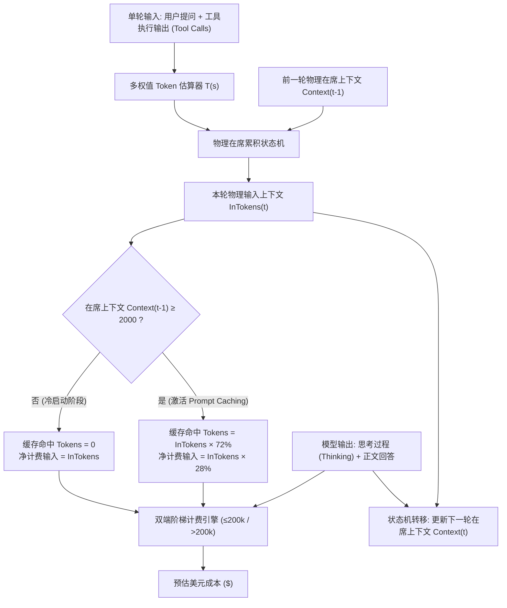

<div align="center">
  <h1>🚀 Antigravity Better</h1>
  <p><strong>自定义你的 Antigravity AI 聊天面板。你的 IDE，你做主。</strong></p>
  <p><strong>Customize your Antigravity AI chat panel. Your IDE, your rules.</strong></p>
  <br>
  <p>
    <a href="./README.md">English</a> •
    <strong>中文</strong>
  </p>
  <p>
    
    
    
    
    
    <br><br>
    <a href="https://github.com/016/Antigravity-Better/releases"></a>
  </p>
</div>

---

## 📸 截图预览

<p align="center">
  
  
</p>

---

## ✨ 什么是 Antigravity Better？

**Antigravity Better** 是一个轻量级、零依赖的工具包，用于自定义 **Antigravity**（Google 推出的 AI IDE）的聊天面板。

我们提供一个 **单一 HTML 文件**，只需替换即可解锁强大的自定义功能 - 无需修改源码或安装扩展。

你可以在我们提供的 HTML 文件上自由定制，开发属于你自己的功能。遵循我们预设的框架进行修改非常简单 - 只需添加你的 CSS 规则和 JS 逻辑即可！

> 💡 **理念**：我们铺好高速公路，你想开什么车都行。

### 兼容性说明

- ✅ **主要目标**：Antigravity（Google AI IDE）
  - **v0.3.x / v0.2.x**：支持 IDE v1.18.3+ 系列（全新 `workbench.html` 架构）
  - **v0.1.x**: 支持旧版 IDE(<1.18.3)（基于 `cascade-panel.html` 架构）
- ⚠️ **可能兼容**：其他基于 VS Code 的 AI IDE（如 Cursor、Windsurf 等）可能需要适配，我们无法保证兼容性。

---

## 🚀 功能特性

### 版本发布列表（不完全）

- **v0.3.0**：正式发布 Token 消耗与模型计费系统（Token & Cost Analytics），引入物理在席上下文累积与 72% 前缀缓存模型，并带来沉浸式会话跳转与深度审计特性：
  - **物理在席累积与 72% 动态前缀缓存（Prompt Caching）建模**：针对 Agentic 多轮长会话，提出物理在席上下文累加与前缀缓存动态拟合算法（在席上下文 ≥ 2000 Tokens 自动激活 72% 前缀缓存命中），精准区分净输入 Token、输出/思考 Token 与缓存命中 Token；支持 ≤200k 与 >200k 双端阶梯定价，未知模型保持未配置费用状态并显式提示；已输出完整开源技术报告至 [`documents/TOKEN_MEASUREMENT_AND_PRICING_ALGORITHM_REPORT.md`](documents/TOKEN_MEASUREMENT_AND_PRICING_ALGORITHM_REPORT.md)。
  - **沉浸式会话精准跳转（上下键）与吸顶脱敏**：彻底解决 Antigravity 原生用户提问卡片 `sticky top-0 z-10`（吸顶粘性定位）导致的几何滚动失效缺陷；重构为基于物理轮次容器 `turnNode` 绝对几何位移与原生 `scrollIntoView` 双重平滑定位，并支持长会话虚拟列表自动向上触发“加载更早历史提问”。
  - **刷新机制与稳定增量审计**：点击用量面板“🔄 刷新”触发轻量增量补扫与聚合重算，维持稳定会话与轮次签名隔离，防止重复入账，并在写库异常时具备稳健自愈容错机制。
  - **历史每日用量表可折叠与暗色高对比度优化**：标题采用 `#f8fafc` 亮白高对比度样式，新增一键折叠/展开功能（`[ 收起表格 ▴ ]` / `[ 展开表格 ▾ ]`），避免长表格占据过多垂直空间。
  - **多维度可视化大屏与图表层级优化**：提供「📈 用量趋势」、「🏷️ 模型定价」、「⚙️ 数据与维护」三大模块；折线图支持青色实线（净输入+输出 Tokens）与紫色虚线（缓存 Tokens）层级共存，鼠标悬浮整点对齐、精准命中率展示与图例收起抽屉。
  - **超大单位智能自适应**：中文界面自动按中文习惯阶梯换算（万、亿、万亿，精度精确至 `53.78亿`、`666.78亿`、`1.69万亿`）；英文界面自动换算为（`K`、`M`、`B`、`T`），随界面语言切换实时更新。
  - **SSH 远程全量会话深度扫描工具**：提供跨平台 `scripts/scan_history_conversations.py`，支持扫描 `~/.gemini/antigravity-ide/` 下全量历史会话（转录日志与 SQLite 元数据），多轮算法同构对齐，一键导出并在前端无损导入归档。
  - **会话 DB 物理安全隔离**：明确前端沙箱与底层存储的边界，提供清空今日统计与清空图表数据的双重防误触二次确认，前端图表重置绝不影响或删除远程服务器上的会话数据库（`.sqlite` / `transcript.jsonl`）。
  - **界面纯净度与折角标记净化**：移除底层输入框工具栏文件图标四周多余的折角标注；严格遵循 CSP 与 Trusted Types 规范，杜绝 `innerHTML` 注入。
- **v0.2.13**：全面加固高危命令防护、重构 LaTeX 公式渲染引擎与交互体验升级：
  - **高危命令防护加固**：重构高危命令检测引擎，引入通用命令执行前缀匹配（`DANGER_CMD_PREFIX`），覆盖命令行行首、管道、分号、逻辑与、IDE 标签格式（`CommandLine:` / `"CommandLine":`）、引号包装、`sudo`/`xargs`/`bash -c` 与绝对路径；重构 DOM 上下文回溯算法，剔除 Tailwind 通用样式类导致的深度早断，精准提取代码块与终端指令；在作用域权限弹窗中引入双重高危审计，未开启高危开关时精准自动点击 `Skip` 并触发 5 秒安全熔断，实现高危命令 100% 拦截与常用开发指令 0 误杀。
  - **LaTeX 渲染引擎增强**：支持公式内部 `<br>` 换行智能清洗与相邻文本节点无缝缝合（`elem.normalize()`），彻底根治带前置说明文字的多行复杂公式渲染失败问题；新增 HTML 实体自动反转义（`&gt;`, `&lt;`, `&quot;`, `&#39;`, `&nbsp;`），消除不等式语法导致的 KaTeX 解析报错；引入环境感知对齐符处理（`aligned`/`cases`/`matrix` 等环境内保留对齐符 `&`，环境外自动转义为 `\&` 杜绝语法崩溃）；自动修复 Markdown 吞噬行间距反斜杠（`\[...pt]` 自动恢复为 `\\[...pt]`）与行尾单反斜杠；全面支持在 `$$...$$` 块级与 `\[...\]` 公式中自动解包由下划线转换而来的 `<em>`/`<strong>` 格式标签。
  - **交互体验与安全确认升级**：新增高危命令执行独立开关与二次确认弹窗（明确提醒工作范围、规范操作行为与 Git 备份）；设置面板功能菜单默认收起折叠且置顶“自动操作”；操作反馈引入双色分流 Toast（绿色跳过/红色警示放行）与浮层统计实时同步。
- **v0.2.11**：新增 `Submit` 自动点击支持，并增加了问卷弹窗保护；新增 `Submit`、`Tool Permissions` 独立开关，支持一键放行常规工具权限申请；修复了高危命令过滤在同级容器内的检测盲区。
- **v0.2.10**：修复对话中 Undo 图标未正确渲染的问题，原因是 CSP 未放行所需的 Google 相关资源；本次通过补充相关策略完成修复，方案来自 hanliangwei。
- **v0.2.9**：修复新建对话时误点历史会话标题的问题；当按钮同时带有 `title` 且包含 `grow` 类名时，跳过自动点击。
- **v0.2.8**：修复程序内版本号仍显示为 `0.2.2` 的问题，并同步整理文档版本信息。
- **v0.2.7**：增强更新检测（GitHub API + 备用 API 回退），支持显示当前/远端版本对比，新增“下载更新”入口和系统工具“自动关闭安装损坏提示”。
- **v0.2.6**：为 diff 确认与权限提示增加自动接受规则，更安全处理 `accept all`、`always allow`、`allow this conversation` 操作。
- **v0.2.5**：优化 workbench UI，emoji 图标替换为内联 SVG，改进 Tab 对齐、悬浮设置按钮、检测更新按钮和关闭按钮点击区域。
- **v0.2.4**：修复 LaTeX 行内公式渲染问题（#23）。
- **v0.2.3**：新增 `workbench.html` 部署工具。
- **v0.2.2**：修复复制按钮显示错位与自动操作点击问题，增加最大点击次数限制与清零功能。
- **v0.2.1**：迁移到 IDE v1.18.3+ 的 `workbench.html` 新架构，实现对 v0.1.7 功能平移。
- **v0.1.7**：旧架构稳定版本（`cascade-panel.html`）。
- **v0.1.6**：将自动重试能力合并到自动操作。
- **v0.1.5**：新增 LaTeX 公式渲染能力。
- **v0.1.4**：新增字体大小控制与版本检测。
- **v0.1.3**：新增安全规则，阻止危险命令自动执行。
- **v0.1.2**：新增自动重试机制。
- **v0.1.1**：首批核心能力：自定义颜色、快捷键覆盖与中英文支持。

### 📊 Token 消耗与模型计费系统 (使用、算法模型与 SSH 扫描指南)

> [!WARNING]
> **⚠️ 计量计价估算与差异声明 (Disclaimer)**
> 本项目内置的 Token 统计与费用计量算法完全运行在本地环境（前端 DOM 差量监听 / 本地转录日志扫描），采用基于字符特征加权的启发式分词与物理在席上下文状态机进行建模。
> **该数据为纯本地估算（Estimation Model），主要用于开发者日常用量感知与长会话成本趋势分析，可能与云端（如 Google Cloud / Vertex AI / Google AI Studio）官方实际账单存在显著差异**。
> 差异根因包含：云端官方 BPE/SentencePiece 分词器黑盒差异、IDE 客户端动态注入的隐式 System Instructions 与环境变量元数据、官方服务端 Prompt Caching 动态淘汰与命中策略、用户不同订阅套餐包（如 Google One AI Premium / Google Workspace 组织配额）专属折扣等。所有金额展示仅供开发参考，请以服务商官方最终账单为准。

#### 📐 简约计量计价算法模型 (Simplified Algorithm)

为在无直连服务端账单 API 的沙箱环境下准确反映长多轮对话与 Agent 工具调用（Tool Use）的真实成本，系统建立了 **物理在席上下文累积 + 动态 72% 前缀缓存 + 阶梯分级定价** 的精简数学体系：



**核心计算逻辑速查**：
1. **多权值 Token 估算器**：
   $$T(s) = 1.25 \times \text{CJK字符} + 0.80 \times \text{符号字符} + 0.28 \times \text{其他字符（英文/数字/空格）}$$
2. **物理在席累积状态机**：
   $$\text{InTokens}_t = \max\left(\text{TurnRawIn}_t, \, \text{Context}_{t-1} + \text{TurnRawIn}_t\right)$$
   （将上一轮的在席上下文与本轮用户输入、工具执行产生的大量终端输出与文件片段一并累积为当前物理输入）。
3. **动态 72% 前缀缓存 (Prompt Caching)**：
   $$\text{CacheTokens}_t = \begin{cases} 0, & \text{Context}_{t-1} < 2000 \\ \min\left(\text{Context}_{t-1}, \, \lfloor \text{InTokens}_t \times 0.72 \rfloor\right), & \text{Context}_{t-1} \ge 2000 \end{cases}$$
   （长会话中约 72% 的前置系统设定与历史消息享受云端 KV Cache 优惠，净计费输入为 $28\%$）。
4. **双端阶梯计费 (Tiered Pricing)**：
   $$\text{Cost}_t = \frac{\text{NetInTokens}_t \times P_{\text{in}} + \text{OutTokens}_t \times P_{\text{out}} + \text{CacheTokens}_t \times P_{\text{cache}}}{1,000,000}$$
   根据模型配置自动匹配单价（例如 Gemini 3.8 Flash：输入 \$0.75/M，缓存读取 \$0.075/M，输出 \$3.75/M；Gemini 3.1 Pro 支持 >200k 阶梯分级计价）。

> 📖 如需查阅完整的理论推导、同构对齐证明与数据坏账自愈机制，请参阅开源技术白皮书：[`documents/TOKEN_MEASUREMENT_AND_PRICING_ALGORITHM_REPORT.md`](documents/TOKEN_MEASUREMENT_AND_PRICING_ALGORITHM_REPORT.md)。

#### 🛠️ 使用与全量历史扫描指引

1. **日常实时监控**：
   - 点击侧边栏「用量」选项卡，实时查看今日与累计 Token 及预估费用；
   - 点击图表或「⚙️ 管理与配置」可展开 90vw × 85vh 的全屏可视化大屏，支持今日/周/月/全量过滤。
2. **全量历史回溯扫描与一键导入**：
   - 如需统计过往数月产生的数十万轮真实历史用量，在项目根目录运行离线扫描工具：
     ```bash
     python3 scripts/scan_history_conversations.py -a
     ```
   - 扫描完成后将在当前目录生成 `antigravity_history_tokens.json`；
   - **一键导入**：在 IDE 右上角「📊 用量」浮窗顶部直接点击「📥 导入」按钮（或在全屏大屏「⚙️ 数据与维护」页面点击「导入用量明细 JSON」），选择该文件即可将全量历史数据瞬间同步至仪表盘！

### 开发者友好

- **单文件架构**：所有 CSS/JS/HTML 集成在一个文件
- **零构建工具**：无需 npm、无需打包 - 直接编辑替换
- **性能优先**：禁用的功能 = 零运行时开销
- **注释清晰**：代码结构明确，易于理解
- **易于扩展**：按照简单模式添加你自己的功能

---

## 📦 安装方法

### 快速开始

1. **找到目标文件**
   ```
   macOS: /Applications/Antigravity.app/Contents/Resources/app/out/vs/code/electron-browser/workbench/workbench.html
   Windows: [应用安装目录]/Antigravity/resources/app/out/vs/code/electron-browser/workbench/workbench.html
   ```

2. **备份并替换**
   ```bash
   # 进入安装目录
   ## Mac os
   cd /Applications/Antigravity.app/Contents/Resources/app/out/vs/code/electron-browser/workbench/
   ## Windows
   cd [应用安装目录]/Antigravity/resources/app/out/vs/code/electron-browser/workbench/

   # 备份原文件
   cp workbench.html workbench.html.bak

   # 替换为 Antigravity Better
   cp /path/to/antigravity-better/app_root/workbench.html ./
   ```

3. **重启 Antigravity** - 完成！🎉

> ⚠️ **注意**：每次 Antigravity 版本升级时，都会覆盖这个 HTML 文件。升级后需要重新执行一次替换操作。

### 🛠️ 常见问题处理 (Mac OS)

如果你在 Mac OS 上（特别是 **v1.20.5** 版本）遇到 **“文件已损坏，应移至废纸篓”** 的提示，请按照以下步骤操作：

1. 选择 **取消** 以保留文件。
2. 进入 **“系统设置”** -> **“隐私与安全性”** -> **“安全性”** 部分。
3. 你会看到对应的 Antigravity 被阻拦的信息，点击 **“仍要打开”**。
4. 再次尝试打开 Antigravity。在弹出的选项中选择 **“打开”**（可能需要**鼠标右键点击**应用并选择 **“打开”**，而不是直接双击）。
5. 只需要这样操作一次，给予运行权限后就不会再出问题。

*注：目前仅在 macOS 平台上进行了测试，其他平台可能会遇到类似问题，请自行寻找对应的系统权限解决方案。*

---

## 🛠️ 自定义配置

### 使用设置面板

点击聊天面板右侧的 **⚙️ 悬浮按钮** 打开设置。

- 在 **外观** 和 **功能** 选项卡之间切换
- 展开/折叠各个功能区块
- 点击右上角按钮切换 中文/English

### 添加自己的功能

Antigravity Better 专为扩展设计：

```html
<style>
  /* 1. 添加 CSS - 仅在功能启用时生效 */
  #react-app.your-feature .target { color: red; }
</style>

<script>
  // 2. 添加功能配置
  const YOUR_CONFIGS = [{ id: 'my-feature', ... }];

  // 3. 实现逻辑（遵循开关状态）
  function applyYourFeature() {
    if (!currentSettings.yourFeatureEnabled) return;
    // 你的代码
  }
</script>
```

---

## 🤝 参与贡献

欢迎各种形式的贡献：

- 🐛 Bug 反馈
- 💡 功能建议
- 🔧 Pull Request
- 📖 文档完善

### 🌟 贡献者

感谢所有优秀的贡献者！你们太棒了！💖

| 贡献者 | 贡献内容 | 日期 |
|--------|----------|------|
| [@moshouhot](https://github.com/moshouhot) | 🤖 自动操作 + 🛡️ 安全规则 - 可配置按钮自动点击，支持危险命令过滤 | 2026-01-24 |
| [@chengcodex](https://github.com/chengcodex) | 🔄 自动重试 - 智能错误检测与自动重试，采用 XPath 优化性能（v0.1.6 已合并到自动操作） | 2026-01-23 |

---

## 📜 开源协议

MIT License - 自由使用、修改、分享。

---

## 🔗 链接

- 🌐 官网：[dpit.lib00.com](https://dpit.lib00.com)
- 🐛 问题反馈：[GitHub Issues](https://github.com/016/Antigravity-Better/issues)

---

<div align="center">
  <sub>Built with ❤️ by the Antigravity Better Team</sub>
</div>
